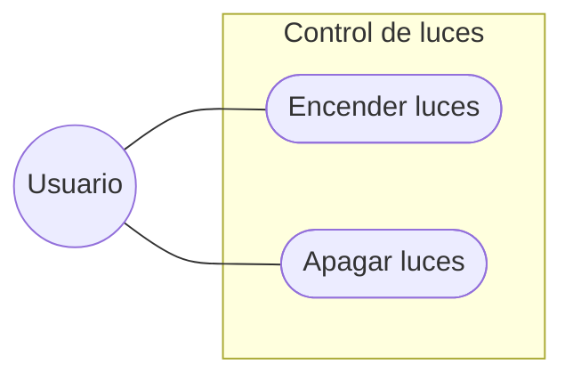
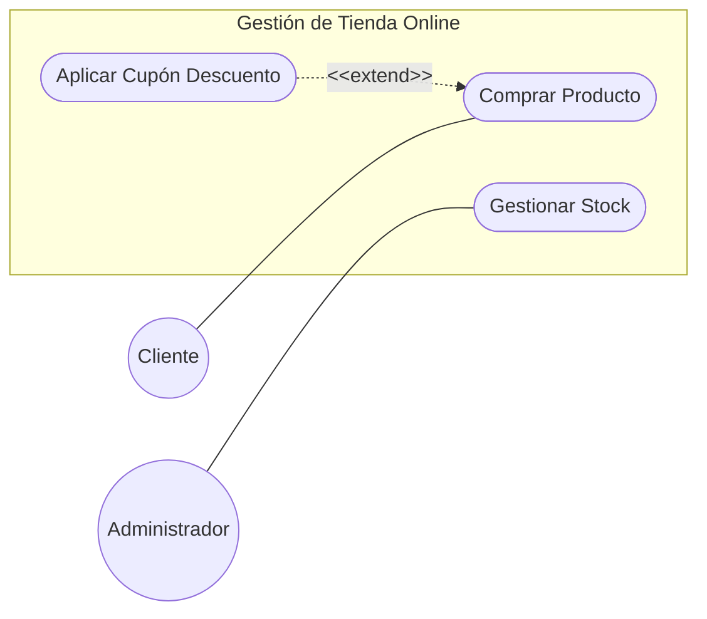
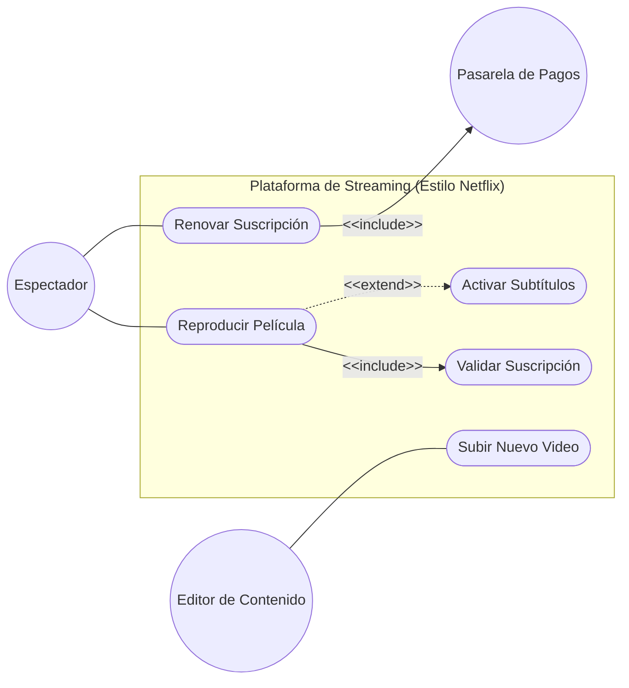

# Entornos-7.2

# Actividad-casos-de-uso
El Sistema de Iluminación Inteligente

```mermaid
graph LR
%% Actor
Usuario((Usuario))

%% Límite del Sistema
subgraph "Control de luces"
   
    CU1([Encender luces])
    CU2([Apagar luces])
end

%% Relaciones actor-casos de uso
Usuario --- CU1
Usuario --- CU2
```

Gestión de Tienda Online

```mermaid
graph LR
%% Definición de Actores
Cliente((Cliente))
Admin((Administrador))
subgraph "Gestión de Tienda Online"
%% Casos de Uso
CU1([Comprar Producto])
CU2([Aplicar Cupón Descuento])
CU3([Gestionar Stock])
%% Relación de Extensión (Opcional)
%% La flecha apunta del extensor al base
CU2 -.->|&lt;&lt;extend&gt;&gt;| CU1
end
%% Relaciones de los Actores
Cliente --- CU1
Admin --- CU3
```
 Plataforma de Streaming (Estilo Netflix)

```mermaid
graph LR
%% Actores
Espectador((Espectador))
Editor((Editor de Contenido))
Pasarela((Pasarela de Pagos))

%% Sistema
subgraph "Plataforma de Streaming (Estilo Netflix)"
    CU1([Reproducir Película])
    CU2([Validar Suscripción])
    CU3([Activar Subtítulos])
    CU4([Subir Nuevo Video])
    CU5([Renovar Suscripción])
end

%% Relaciones actor-casos de uso
Espectador --- CU1
Espectador --- CU5
Editor --- CU4

%% Include y extend
CU1 -->|&lt;&lt;include&gt;&gt;| CU2
CU1 -.->|&lt;&lt;extend&gt;&gt;| CU3
CU5 -->|&lt;&lt;include&gt;&gt;| Pasarela
```
